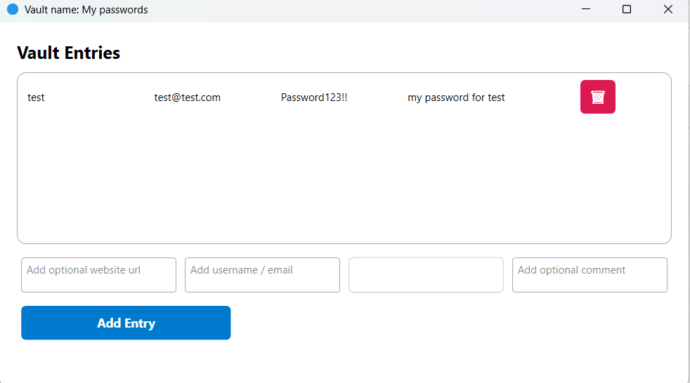

# Password Manager

This is a simple and secure **Password Manager** built with **C# (WPF)**.  

---

## how is the data stored :

The data are stored using aes 256 encryption 
The key used for encryption is a **derivation** of the user master password + a salt

All of the data is written on a file called encrypted.bin in json serialized object like that:

{"Name":"My passwords","IV":"iXUhN2Idla6vAyZ2aqngJQ==","Salt":"b7gHxTE5O0cEwyysJ9+sMPBrqNxqWGq+t9KdZkGGyQ8=","EncryptedData":"2svei9tV29wcx5lRzBJ+AKBnRu/QVLxrFSObm1Ek9AI="}

---

# 

