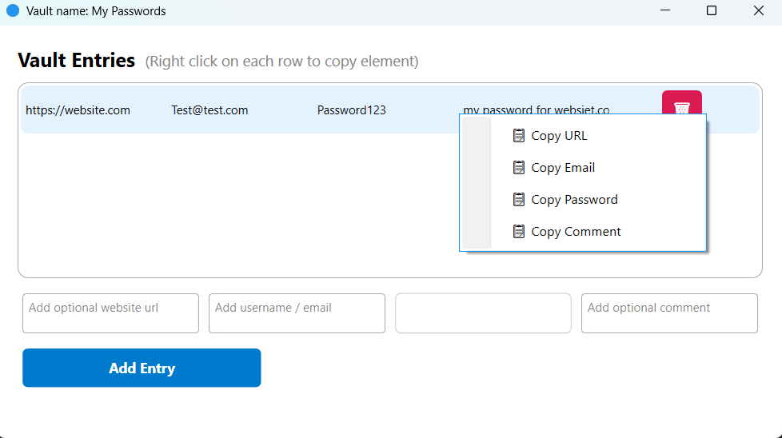
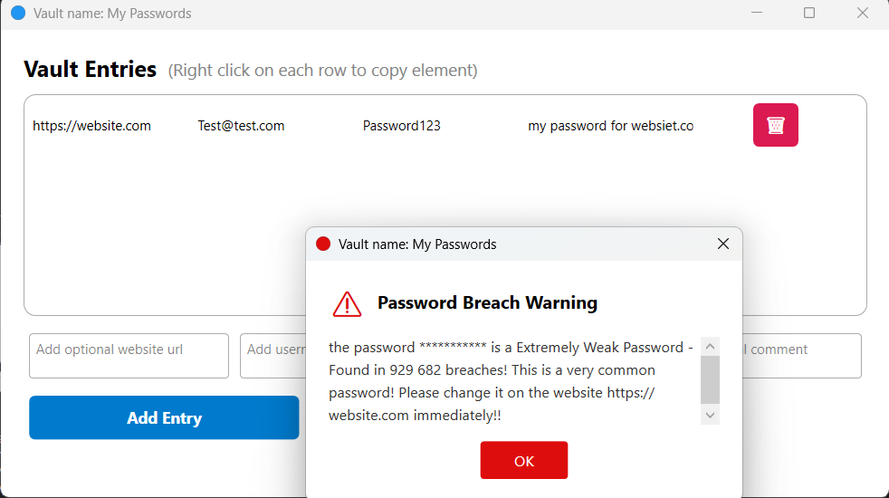

# 🔐 Password Manager

This is a simple and secure **Password Manager** built with **C# (WPF)**.  

---

## 🗄️ How is the data stored

The data is stored using **AES-256 encryption**.  
The encryption key is a **derivation** of the user's master password combined with a **unique salt**.

All data is written to a file named `encrypted.bin`, which contains a **JSON-serialized object** similar to this:

```json
{
  "Name": "My passwords",
  "IV": "iXUhN2Idla6vAyZ2aqngJQ==",
  "Salt": "b7gHxTE5O0cEwyysJ9+sMPBrqNxqWGq+t9KdZkGGyQ8=",
  "EncryptedData": "2svei9tV29wcx5lRzBJ+AKBnRu/QVLxrFSObm1Ek9AI="
}
```
## Features

- **Full Password Management** - Create, view, copy, and delete password entries with ease
- **One-Click Copy** - Right-click any entry to instantly copy URL, email, password, or comments to clipboard
- **Breach Detection** - Automatic warnings when passwords are found in known data breaches
- **Security Insights** - View how many times a password has appeared in compromised databases


*Quick access to all your credentials with right-click context menu*


*Real-time alerts for compromised passwords*

